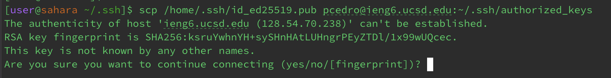

# CSE15L Lab Report 2
---
## Part 1:
__Chatserver code:__
```
# code block
import java.io.IOException;
import java.net.URI;

class ChatHandler implements URLHandler {

    private StringBuilder chatHistory = new StringBuilder();

    public String handleRequest (URI url) {
        if (url.getPath().equals("/add-message")) {
            String query = url.getQuery();
            String s = null;
            String user = null;

            if (query != null) {
                for (String parameter : query.split("&")) {
                    String[] param = parameter.split("=");
                if (param.length == 2) {
                    if (param[0].equals("s")) {
                        s = param[1];
                    } else if (param[0].equals("user")) {
                        user = param[1];
                    }
                 }
             }
         }
            if (s != null && user != null) {
                chatHistory.append(String.format("%s: %s\n", user, s));
                return chatHistory.toString();
            }
           }
           return "404 Not Found!";
        }
    }


class ChatServer {
    public static void main(String[] args) throws IOException {
        if(args.length == 0){
            System.out.println("Missing port number! Try any number between 1024 to 49151");
            return;
        }

        int port = Integer.parseInt(args[0]);

        Server.start(port, new ChatHandler());
    }
}
```

__Output 1:__

1. Which methods in your code are called?

The method handle in ServerHttpHandler gets called as a request is being made within the web server: 
```
(/add-message?s=CSE15L&user=paola)
```
Afterwards, the method handleRequest in ChatHandle is called to handle the paths.

2. What are the relevant arguments to those methods, and the values of any relevant fields of the class?

The argument relevant to ServerHttpHandler.handle is exchange as the HttpExchange gets the request URI and gives it to the handleRequest method in ChatHandler. Thus, ChatHandler.handleRequest has the args url, which is the request URI (/add-message).

3. How do the values of any relevant fields of the class change from this specific request? If no values got changed, explain why.

A relevant field to the ChatHandler class is chatHistory, which stores the chat messages as a StringBuilder object. The chatHistory field gets modified by handleRequest method when a new message is appended. 

__Output 2:__

1. Which methods in your code are called?

In this example, the handleRequest method in the ChatHandler file is called to respond to the request in the web server, checking which path is used along with parsing the query parameters and updating the chatHistory to hold the strings.
```
(/add-message?s=Banana!&user=Minion)
```
2. What are the relevant arguments to those methods, and the values of any relevant fields of the class?

A relevant argument to the handleRequest method would be URI url in the method header, representing the url argument. Furthermore, chatHistory is a relevant field to the ChatHandler class as it holds the previous chat messages and adds the new ones.

3. How do the values of any relevant fields of the class change from this specific request? If no values got changed, explain why.
The values of the chatHistory field changes from this specific request because it is appending the new message "Minions: Banana!" to the chatHistory.


---
## Part 2:
1.The absolute path to the private key for your SSH key for logging into ieng6 (on your computer, an EdStem workspace, or on the home directory of the lab computer)

2.The absolute path to the public key for your SSH key for logging into ieng6 (this is the one you copied to your account on ieng6, so it should be a path on ieng6's file system)

3. A terminal interaction where you log into your ieng6 account without being asked for a password.

___
## Part 3:
As I am new to Git and Github, I have learned many new techniques within that realm. I am now more familiar with setting up SSH keys on my own personal account, as I didn't know they existed before. Furthermore, I have learned how to access web servers and new terminology within code, such as commands like mkdir (make directory) and scp command(copies files and directories). This new knowledge will be extremely helpful in the future when navigating code. Although I still have a lot more to learn, I feel more comfortable when using web servers and git.
